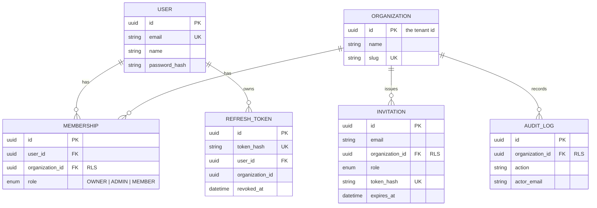

# Secure Auth System — Backend


> Multi-tenant authentication & authorization service with RBAC — JWT claims carry the tenant, and **PostgreSQL Row-Level Security** guarantees data isolation at the database level, even if application code makes a mistake.

## About

Backend for the [secure-auth-system](https://github.com/kevinmistrele/secure-auth-system) frontend. Users belong to one or more **organizations** (tenants) through **memberships** that carry a role (`OWNER`, `ADMIN`, `MEMBER`). Every session is bound to exactly one organization; every tenant-scoped query runs behind an RLS policy.

## Features

- **Organizations (tenants)** — registration creates the user's organization; users can belong to many and switch between them
- **RBAC** — roles with a permission map, enforced by custom guards/decorators: `@Roles('ADMIN')`, `@RequirePermission('invitations:create')`
- **Tenant claims in the JWT** — the access token carries `sub`, `email`, `tenantId`, `role`
- **Row-Level Security in Postgres** — `SET app.current_tenant` (transaction-local) + policies on every business table; a query without a `WHERE` clause still can't see another tenant's rows
- **Invitation flow** — admin invites an email with a role; accepting the token creates the membership
- **Refresh tokens** — opaque, hashed at rest, rotated on every use, revocable, with reuse (theft) detection
- **Password reset** by email, **audit trail** per organization

## How the isolation works

```
JWT (tenantId, role) ──> JwtAuthGuard ──> RolesGuard / PermissionsGuard
                                              │
                              @CurrentTenant() (verified claim only)
                                              │
                     TenantPrismaService.withTenant(tenantId, fn)
                        └─ BEGIN; SELECT set_config('app.current_tenant', $id, true); ...
                                              │
                     PostgreSQL (role app_user, no BYPASSRLS)
                        └─ POLICY: organization_id = current_setting('app.current_tenant')
```

Two database roles on purpose: migrations and the pre-tenant auth flows (login, refresh, invite accept) use the privileged connection; **everything else runs as `app_user`, where RLS is enforced**. With no tenant context set, the policies return zero rows — fail closed. Details: [`docs/architecture/tenancy-and-rls.md`](./docs/architecture/tenancy-and-rls.md).

## Data model



Tables marked **RLS** have `ENABLE`/`FORCE ROW LEVEL SECURITY` and a `tenant_isolation` policy (see [`prisma/migrations`](./prisma/migrations)). `users` and `refresh_tokens` are deliberately global — they are the identity/auth plane.

## Getting started

Prerequisites: Node.js 20+, Docker.

```bash
git clone https://github.com/kevinmistrele/secure-auth-system-backend.git
cd secure-auth-system-backend
npm install
cp .env.example .env
docker compose up -d          # Postgres 16
npx prisma migrate dev        # DDL + RLS policies + app_user role
npm run start:dev             # http://localhost:3001/api
```

### Checks

```bash
npm run typecheck
npm run lint
npm run test        # unit: RBAC map, guards
npm run test:e2e    # the proof: tenant A cannot read tenant B (API + raw RLS)
```

## API

| Method | Route | Access | Description |
|---|---|---|---|
| POST | `/api/auth/register` | public | Create user + organization (caller becomes OWNER) |
| POST | `/api/auth/login` | public | JWT pair with tenant + role claims |
| POST | `/api/auth/refresh` | public | Rotate the refresh token |
| POST | `/api/auth/logout` | public | Revoke a refresh token |
| POST | `/api/auth/switch-tenant` | auth | New token pair for another organization you belong to |
| GET | `/api/auth/me` | auth | Current user, organization, role, memberships |
| POST | `/api/auth/request-password-reset` | public | Email a reset link |
| POST | `/api/auth/reset-password` | public | Set a new password, revoke sessions |
| POST | `/api/organizations` | auth | Create another organization (caller becomes OWNER) |
| GET | `/api/organizations` | auth | Organizations the caller belongs to |
| GET | `/api/organizations/current` | `org:read` | Current tenant details |
| PATCH | `/api/organizations/current` | `org:update` | Rename the organization |
| GET | `/api/members` | `members:read` | Members of the current organization |
| PATCH | `/api/members/:userId` | `members:update` | Change a member's role |
| DELETE | `/api/members/:userId` | `members:remove` | Remove a member |
| POST | `/api/invitations` | `invitations:create` | Invite an email (returns the invite link) |
| GET | `/api/invitations` | `invitations:read` | Pending invitations |
| DELETE | `/api/invitations/:id` | `invitations:revoke` | Revoke an invitation |
| POST | `/api/invitations/accept` | auth | Accept an invitation token → membership |
| GET | `/api/audit-logs` | `audit:read` | Tenant audit trail |

Permissions map to roles in [`src/common/rbac/permissions.ts`](./src/common/rbac/permissions.ts): OWNER holds everything, ADMIN manages members/invitations/audit, MEMBER reads.

## Documentation

- [`AGENTS.md`](./AGENTS.md) — the code standard for humans and agents working here
- [`docs/architecture`](./docs/architecture) — overview, structure, dependency rules, tenancy & RLS
- [`docs/standards`](./docs/standards) — TypeScript, naming, errors, tests, security, git
- [`docs/decisions`](./docs/decisions) — ADRs: two DB roles, transaction-scoped tenant context, refresh rotation

## Frontend

Pair this API with the [secure-auth-system](https://github.com/kevinmistrele/secure-auth-system) React frontend.

## Author

Made by [Kevin Mistrele](https://github.com/kevinmistrele)
